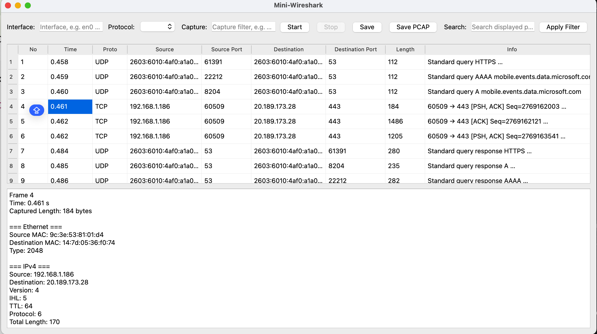

# Mini-Wireshark
A simplified Wireshark-like network packet analyzer built using Python, Scapy, and PyQt5.

This project captures live network traffic, parses common network protocols, and displays them in a graphical interface with filtering and detailed packet inspection.

## Features
- Live packet capture using Scapy
- Graphical interface built with PyQt5
- Protocol support:
  - TCP (flags, sequence number, acknowledgment, window size, payload length)
  - UDP
  - DNS (queries, responses, A/AAAA records)
  - ICMP (echo request/reply, unreachable, time exceeded)
  - ARP
- IPv4 and IPv6 support
- Capture filtering 
- Display filtering (search packets by content)
- Packet detail panel (layered inspection of Ethernet, IP, TCP/UDP/ICMP, DNS)
- Export captured packets:
  - CSV (summary view)
  - PCAP (full packet data)

## Screenshot

## Acknowledgements
This project was developed with assistance from AI tools (ChatGPT), which were used to:
- clarify networking concepts
- debug issues during development
- improve code structure and design decisions
